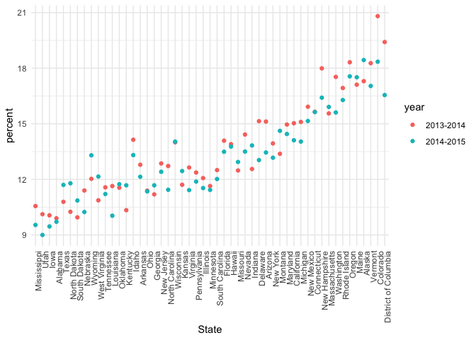

Strings and Factors
================
Wenxin Tian
2023-10-17

``` r
library(rvest)
library(tidyverse)
```

    ## ── Attaching core tidyverse packages ──────────────────────── tidyverse 2.0.0 ──
    ## ✔ dplyr     1.1.3     ✔ readr     2.1.4
    ## ✔ forcats   1.0.0     ✔ stringr   1.5.0
    ## ✔ ggplot2   3.4.3     ✔ tibble    3.2.1
    ## ✔ lubridate 1.9.2     ✔ tidyr     1.3.0
    ## ✔ purrr     1.0.2     
    ## ── Conflicts ────────────────────────────────────────── tidyverse_conflicts() ──
    ## ✖ dplyr::filter()         masks stats::filter()
    ## ✖ readr::guess_encoding() masks rvest::guess_encoding()
    ## ✖ dplyr::lag()            masks stats::lag()
    ## ℹ Use the conflicted package (<http://conflicted.r-lib.org/>) to force all conflicts to become errors

``` r
library(p8105.datasets)
```

## Strings and Regular Expressions (Regex) :

``` r
string_vec = c("my", "name", "is", "jeff")

str_detect(string_vec, "je")
```

    ## [1] FALSE FALSE FALSE  TRUE

``` r
"jeff" %in% string_vec
```

    ## [1] TRUE

``` r
str_replace(string_vec, "e", "E")
```

    ## [1] "my"   "namE" "is"   "jEff"

For exact matches, you can designate matches at the beginning or end of
a line.

``` r
string_vec = c(
  "i think we all rule for participating",
  "i think i have been caught",
  "i think this will be quite fun actually",
  "it will be fun, i think"
  )

str_detect(string_vec, "^i think")
```

    ## [1]  TRUE  TRUE  TRUE FALSE

``` r
str_detect(string_vec, "i think$")
```

    ## [1] FALSE FALSE FALSE  TRUE

You can also designate a list of characters that count as a match:

``` r
string_vec = c(
  "Time for a Pumpkin Spice Latte!",
  "went to the #pumpkinpatch last weekend",
  "Pumpkin Pie is obviously the best pie",
  "SMASHING PUMPKINS -- LIVE IN CONCERT!!"
  )

str_detect(string_vec,"[Pp]umpkin")
```

    ## [1]  TRUE  TRUE  TRUE FALSE

No need to list them. Can provide a list expression that counts as a
match:

``` r
string_vec = c(
  '7th inning stretch',
  '1st half soon to begin. Texas won the toss.',
  'she is 5 feet 4 inches tall',
  '3AM - cant sleep :('
  )

str_detect(string_vec, "^[0-9][a-zA-Z]")
```

    ## [1]  TRUE  TRUE FALSE  TRUE

The character `.` will match anything

``` r
string_vec = c(
  'Its 7:11 in the evening',
  'want to go to 7-11?',
  'my flight is AA711',
  'NetBios: scanning ip 203.167.114.66'
  )

str_detect(string_vec, "7.11")
```

    ## [1]  TRUE  TRUE FALSE  TRUE

## Factors:

``` r
vec_sex = factor(c("male", "male", "female", "female", "neither"))

vec_sex
```

    ## [1] male    male    female  female  neither
    ## Levels: female male neither

``` r
as.numeric(vec_sex)
```

    ## [1] 2 2 1 1 3

``` r
vec_sex = fct_relevel(vec_sex, "male", "neither")

vec_sex
```

    ## [1] male    male    female  female  neither
    ## Levels: male neither female

``` r
as.numeric(vec_sex)
```

    ## [1] 1 1 3 3 2

## NSDUH

``` r
nsduh_url = "http://samhda.s3-us-gov-west-1.amazonaws.com/s3fs-public/field-uploads/2k15StateFiles/NSDUHsaeShortTermCHG2015.htm"

table_marj = 
  read_html(nsduh_url) |> 
  html_table() |> 
  first() |>
  slice(-1) |>
  as_tibble()
```

Do some cleaning of the data with string functions that we just learned:

``` r
data_marj =
  table_marj |>
  select(-contains("P value")) |>
  pivot_longer(
    -State,
    names_to = "age_year",
    values_to = "percent"
  ) |>
  separate(age_year, into = c("age", "year"), sep = "\\(") |>
  mutate(
    year = str_replace(year, "\\)", ""),
    percent = str_replace(percent, "[a-c]$", ""),
    percent = as.numeric(percent)
  ) |>
  filter(!(State %in% c("Total U.S.", "Northeast", "Midwest", "South", "West")))
```

## NDSUH Factors:

``` r
data_marj |>
  filter(age == "12-17") |>
  ggplot(aes(x = State, y = percent, color = year)) +
  geom_point() +
  theme_minimal() +
  theme(axis.text.x = element_text(angle = 90, hjust = 1))
```

<!-- -->

Ordering variable with factors:

``` r
data_marj |>
  mutate(State = fct_reorder(State, percent)) |>
  filter(age == "12-17") |>
  ggplot(aes(x = State, y = percent, color = year)) +
  geom_point() +
  theme_minimal() +
  theme(axis.text.x = element_text(angle = 90, hjust = 1))
```

<!-- -->
